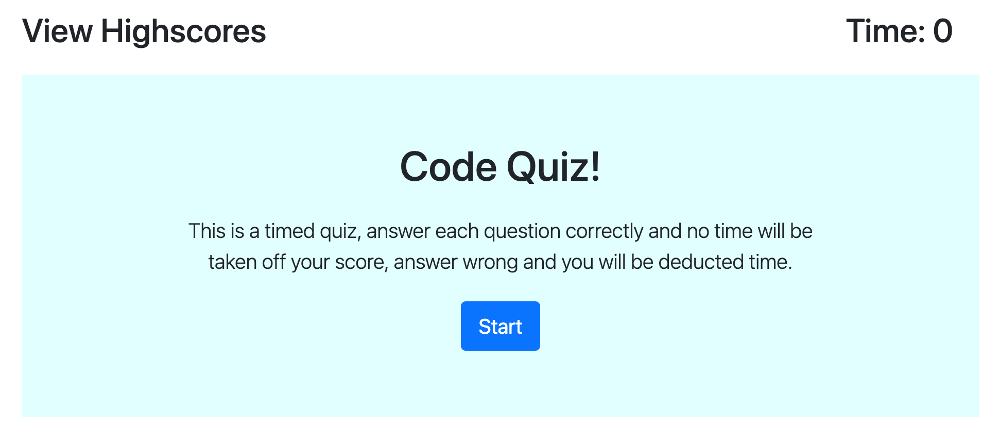

### code-quiz

## Technologies Used: Javascript, HTML, CSS

## Description:
This project uses Javascript, HTML, and CSS to create a timed code quiz. Once the user clicks start they are directed to the first question, if they answer the question correctly no time is taken off the timer, if they answer incorrectly time is deducted from the timer. The score at the end is the total left on the timer when it ends. The quicker you answer and the more correct answers you have the higher the score will be. 

Once the quiz is finished the user is directed to the highscores page where they are prompted to enter their initials and their score is shown on the page. 

## Links
Github:  https://github.com/Lexi-Diamond/code-quiz.git
Live Application:  https://lexi-diamond.github.io/code-quiz/

